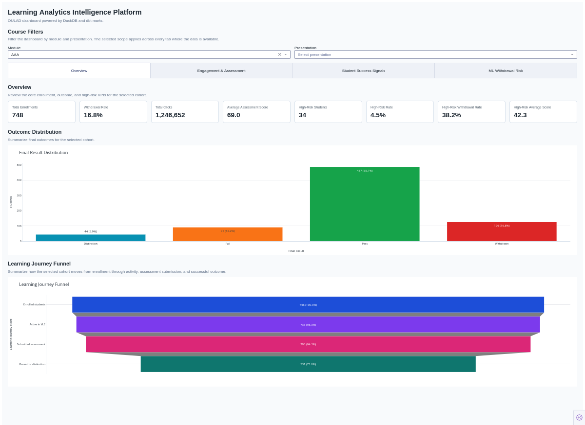
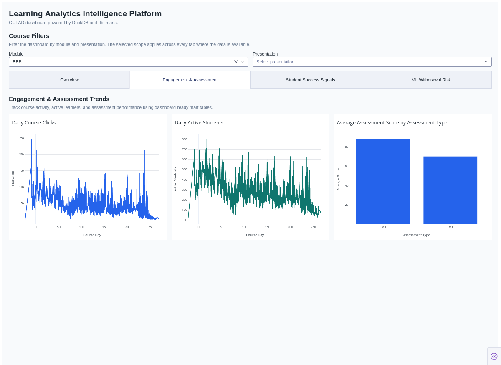
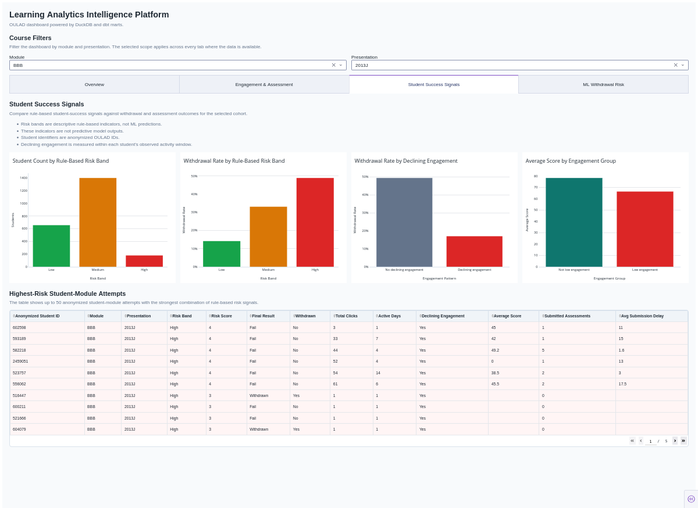
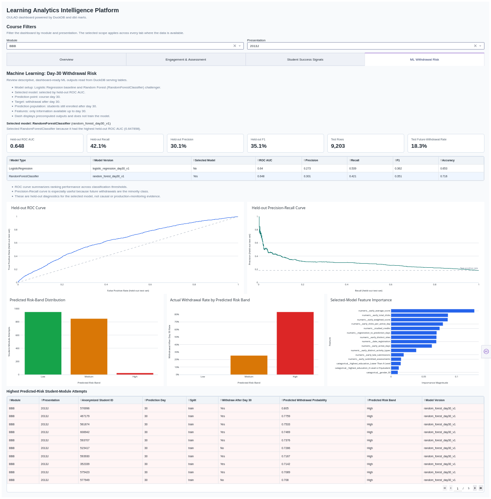

# Learning Analytics Intelligence Platform

The Learning Analytics Intelligence Platform is a local analytics engineering,
BI, and leakage-safe ML portfolio project built on OULAD data. It creates a
DuckDB and dbt-powered learning analytics workflow for course engagement,
assessment performance, student-success indicators, and day-30 withdrawal-risk
model outputs.

The project is designed for transparent analytics work: raw data is validated,
modeled into documented dbt marts, surfaced in a Dash dashboard, and extended
with precomputed ML serving tables. Dash reads approved DuckDB tables and does
not train models.

## Key Questions

- How does learner engagement evolve across course presentations?
- How are engagement patterns associated with withdrawal outcomes?
- Do low-engagement students score lower?
- Which anonymized student-module attempts show multiple rule-based risk
  signals?
- How do leakage-safe day-30 ML withdrawal-risk outputs compare across a
  baseline and challenger model?

## End-To-End Workflow

The repository includes a full local analytics workflow:

- Raw OULAD validation for required files and schemas.
- Raw-to-DuckDB ingestion into a local warehouse.
- dbt staging, intermediate, and mart modeling with dbt-duckdb.
- dbt tests and documentation for governed mart tables.
- Dash and Plotly dashboard with four analytical tabs.
- GitHub Actions CI for Python syntax, lint, formatting, and dbt parse checks.
- Airflow-style orchestration DAG for local pipeline steps.
- Governed insight-card generator for deterministic aggregate summaries.
- Leakage-safe ML workflow for day-30 withdrawal-risk prediction outputs.

## Architecture

```text
OULAD raw CSVs
-> raw data validation
-> DuckDB raw tables
-> dbt sources
-> dbt staging models
-> dbt intermediate models
-> dbt marts
-> leakage-safe ML feature mart
-> Python ML training/scoring outside Dash
-> DuckDB ML serving tables
-> Dash dashboard
-> governed aggregate insight cards
```

The Airflow-style DAG is implemented under `orchestration/dags/` and
orchestrates local validation, DuckDB loading, `dbt run`, and `dbt test`.

The governed insight-card generator is implemented under `insights/` and writes
deterministic aggregate JSON cards from approved marts.

## Data Source

This project uses the Open University Learning Analytics Dataset (OULAD). Raw
CSV files are stored locally under `data/raw/` and are not committed to Git.
OULAD student IDs are anonymized identifiers.

## dbt Models

The dbt project organizes the warehouse into:

- `staging`: typed and standardized source-aligned views.
- `intermediate`: reusable joins and learning-activity logic.
- `marts`: dashboard-ready business tables.
- student-success and ML marts for rule-based indicators and leakage-safe
  model features.

Important mart models include:

- `dim_student_module`
- `fct_course_engagement_daily`
- `fct_assessment_performance`
- `fct_student_engagement_summary`
- `fct_student_assessment_summary`
- `mart_student_success_features`
- `mart_withdrawal_prediction_features`

## Dashboard

The Dash dashboard reads from local DuckDB mart and ML serving tables. It uses
global module and presentation filters and has four tabs:

- Overview
- Engagement & Assessment
- Student Success Signals
- ML Withdrawal Risk

Dashboard content includes:

- KPI cards.
- Final result distribution with counts and percentages.
- Learning journey funnel with counts and percentages.
- Engagement and assessment trends.
- Rule-based student-success signals.
- Highest-risk anonymized student-module attempts from rule-based indicators.
- Precomputed ML withdrawal-risk results.
- Model comparison table.
- Selected-model feature importance.
- Held-out ROC and Precision-Recall diagnostic charts.

Rule-based risk bands are descriptive indicators. ML predicted risk bands are
separate model outputs generated by the ML workflow. Neither the rule-based
signals nor the ML predictions should be interpreted as causal evidence.

## Screenshots

### Overview Tab



### Engagement & Assessment Tab



### Student Success Signals Tab



### ML Withdrawal Risk Tab



## ML Workflow

The ML workflow is leakage-safe and runs outside Dash:

- dbt creates the feature mart `mart_withdrawal_prediction_features`.
- Prediction point: course day 30.
- Target: withdrawal after day 30.
- Population: students still enrolled after day 30.
- Features use only information available up to day 30.
- Python trains and scores models outside the dashboard.
- Logistic Regression is the baseline model.
- Random Forest is the challenger model.
- The selected model is chosen by held-out ROC AUC, with Logistic Regression
  preferred in ties.
- Model comparison, selected-model feature importance, held-out ROC curve, and
  held-out Precision-Recall curve outputs are stored.
- Outputs are written to DuckDB ML serving tables.
- The dashboard reads the DuckDB serving tables and does not train models.

Current observed run, stated conservatively:

- `RandomForestClassifier` was selected by held-out ROC AUC.
- Held-out ROC AUC was approximately 0.648.
- Average precision was approximately 0.295.
- Precision was approximately 0.301.
- Recall was approximately 0.421.
- F1 was approximately 0.351.
- Future-withdrawal rate in the held-out test set was approximately 18.3%.

Observed trade-off: Logistic Regression remained useful as an interpretable
baseline and had higher recall/F1 in the observed run. Random Forest was
selected because it had the higher held-out ROC AUC.

DuckDB ML serving tables:

- `ml_withdrawal_predictions`
- `ml_withdrawal_metrics`
- `ml_withdrawal_feature_importance`
- `ml_withdrawal_model_comparison`
- `ml_withdrawal_roc_curve`
- `ml_withdrawal_pr_curve`

## How To Run Locally

Create and activate the Conda environment:

```bash
conda env create -f environment.yml
conda activate laip
```

Validate and load the local raw OULAD data:

```bash
python ingestion/validate_raw_data.py
python ingestion/load_raw_to_duckdb.py
```

Build and test the dbt project:

```bash
cd dbt
dbt debug --profiles-dir .
dbt run --profiles-dir .
dbt test --profiles-dir .
cd ..
```

Generate governed insight cards:

```bash
python insights/generate_insight_cards.py
```

Train, score, and write ML serving tables:

```bash
python ml/train_withdrawal_model.py
```

Run the dashboard:

```bash
python dashboard/app.py
```

Then open:

```text
http://127.0.0.1:8050/
```

## Optional Airflow-Style Orchestration

The repository includes an Airflow-style DAG at
`orchestration/dags/laip_pipeline_dag.py`. The DAG represents local pipeline
orchestration for raw validation, DuckDB loading, `dbt run`, and `dbt test`.

Airflow is not installed in the main Conda environment. To use the DAG, an
Airflow runtime should set `LAIP_PROJECT_ROOT` to the project root.

## Repository Hygiene

- Raw CSV files are ignored.
- DuckDB warehouse files are ignored.
- Generated runtime files under `data/processed/` are ignored.
- dbt `target/` and `logs/` artifacts are ignored.
- `.env` files are ignored.
- Only code, configuration, and documentation are committed.
- GitHub Actions CI runs syntax, lint, formatting, and dbt parse checks.
- CI intentionally does not run ingestion, `dbt run`, `dbt test`, ML training,
  or the dashboard because raw data and local DuckDB warehouse files are
  ignored.

## Limitations

- This is a local DuckDB project, not cloud-deployed.
- The Airflow-style DAG is included, but a deployed scheduler is not part of
  the main environment.
- The ML workflow is a leakage-aware baseline/challenger workflow, not a
  production model.
- ROC and Precision-Recall diagnostics are held-out diagnostics, not causal
  evidence.
- Rule-based risk bands are descriptive indicators, not ML predictions.
- OULAD student IDs are anonymized.
- Dashboard and ML outputs depend on locally generated DuckDB tables.

## Portfolio Positioning

This project demonstrates analytics engineering, dbt modeling, BI
dashboarding, data quality testing, CI, local orchestration design, governed
aggregate insight generation, and a leakage-safe ML serving workflow for
responsible learning analytics.
