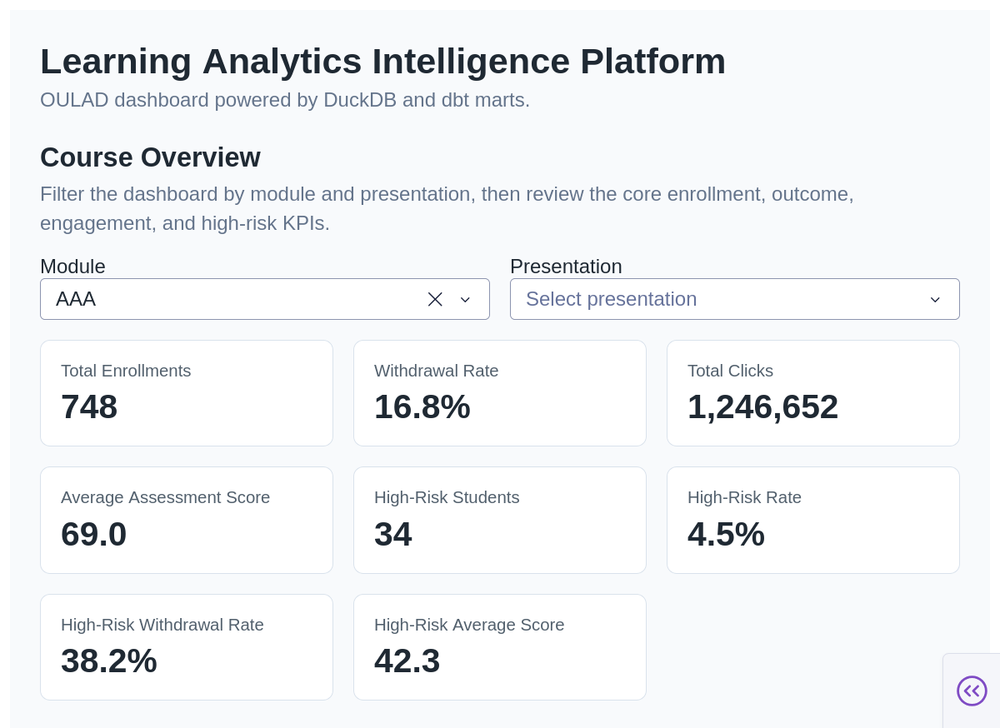
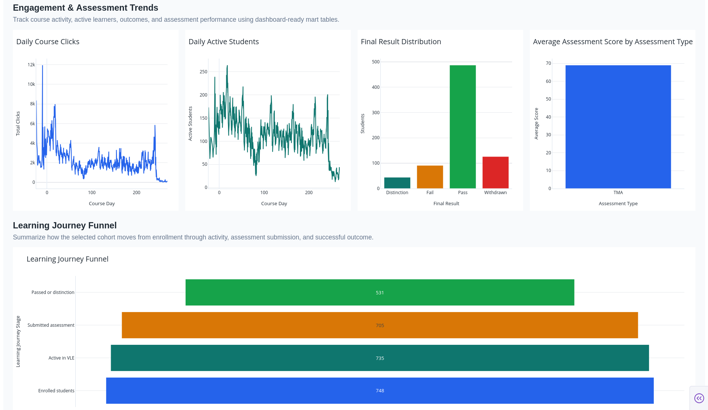
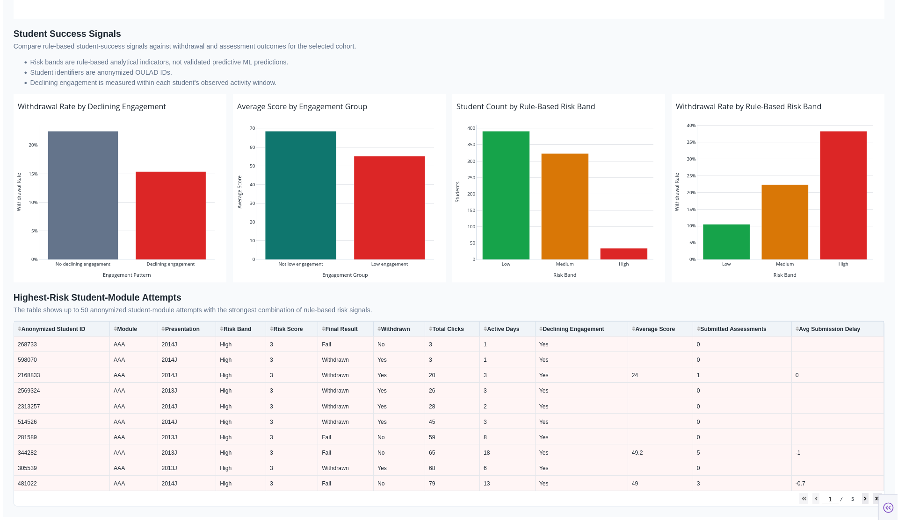

# Learning Analytics Intelligence Platform

The Learning Analytics Intelligence Platform is an analytics engineering and BI
portfolio project built on OULAD data. It creates a local DuckDB and dbt-powered
analytics platform for online learning engagement, assessment performance, course
health, withdrawal patterns, and rule-based student-success risk signals.

The project is designed for transparent learning analytics: raw data is
validated and modeled into documented dbt marts, and the dashboard consumes only
approved mart tables rather than raw, staging, or intermediate data.

## Key Business Questions

- How does learner engagement evolve across course presentations?
- How are engagement patterns associated with withdrawal outcomes?
- Do low-engagement students score lower?
- Which anonymized student-module attempts show multiple rule-based risk signals?
- How can course teams monitor engagement, assessment performance, and
  student-success indicators?

## Current Features

- Raw OULAD file validation for required files and schemas.
- Local DuckDB warehouse for reproducible analytics development.
- dbt staging, intermediate, and mart layers using dbt-duckdb.
- Documented and tested dbt models.
- Dash and Plotly dashboard for course and student-success analytics.
- Student-success feature mart combining demographics, outcomes, engagement,
  assessment behavior, and rule-based risk indicators.
- Rule-based risk segmentation for analytical monitoring.
- Dashboard reads only approved dbt mart tables.
- GitHub Actions CI for Python syntax, lint, formatting, and dbt parse checks.
- Airflow DAG for local pipeline orchestration.
- Airflow DAG tasks orchestrate raw validation, DuckDB loading, `dbt run`, and
  `dbt test`.
- Governed aggregate insight-card generator for future LLM-assisted
  interpretation.

## Architecture

```text
OULAD raw CSVs
-> Airflow DAG orchestration
-> Python validation
-> DuckDB raw tables
-> dbt sources
-> dbt staging models
-> dbt intermediate models
-> dbt marts
-> Dash dashboard
-> governed aggregate insight cards
-> future optional LLM-assisted summaries
```

The Airflow DAG is implemented under `orchestration/dags/` and is intended for
local/runtime orchestration of the existing pipeline steps.

The governed aggregate insight-card generator is implemented under `insights/`
and produces deterministic JSON cards for approved marts. External LLM/API-based
summary generation is planned future work and is not currently implemented.

## Data Source

This project uses the Open University Learning Analytics Dataset (OULAD). Raw
CSV files are stored locally under `data/raw/` and are not committed to Git.

## dbt Model Layers

- `staging`: typed and standardized source-aligned views.
- `intermediate`: reusable joins and learning activity logic.
- `marts`: dashboard-ready business tables.
- `student-success marts`: engagement, assessment, and rule-based risk feature
  tables for student-success analysis.

Current dbt status:

- 16 dbt models.
- 127 dbt data tests.
- 7 raw sources.
- Student-success feature mart documented and tested.

Important implemented mart models include:

- `dim_student_module`
- `fct_course_engagement_daily`
- `fct_assessment_performance`
- `fct_student_engagement_summary`
- `fct_student_assessment_summary`
- `mart_student_success_features`

## Dashboard

The Dash dashboard reads from approved dbt mart tables in DuckDB and includes:

- Module and presentation filters.
- Enrollment and withdrawal KPIs.
- Engagement trends.
- Assessment performance.
- Final-result distribution.
- Risk-band distribution.
- Withdrawal rate by risk band.
- Engagement patterns vs withdrawal rate.
- Low engagement vs average score.
- Highest-risk anonymized student-module attempts table.

The dashboard is organized into Course Overview, Engagement & Assessment
Trends, Learning Journey Funnel, Student Success Signals, and Highest-Risk
Student-Module Attempts sections.

The dashboard directly supports these student-success questions:

- How do engagement patterns relate to withdrawal?
- Did low-engagement students score lower?
- Which anonymized student-module attempts show multiple risk signals?

## Screenshots

### Dashboard Overview

The overview shows module/presentation filtering, course-level KPIs, and the
main engagement and assessment monitoring layout.



### Learning Journey Funnel

The funnel summarizes how the selected cohort moves from enrollment to VLE
activity, assessment submission, and successful outcome.



### Student Success Signals

The student-success section shows rule-based risk segmentation, withdrawal-rate
comparisons, engagement/score patterns, and the highest-risk anonymized
student-module attempts.



## How To Run Locally

Create and activate the Conda environment:

```bash
conda env create -f environment.yml
conda activate laip
```

Validate and load the local raw OULAD data:

```bash
python ingestion/validate_raw_data.py
python ingestion/load_raw_to_duckdb.py
```

Build and test the dbt project:

```bash
cd dbt
dbt debug --profiles-dir .
dbt run --profiles-dir .
dbt test --profiles-dir .
cd ..
```

Run the dashboard:

```bash
python dashboard/app.py
```

Then open:

```text
http://127.0.0.1:8050/
```

### Optional Airflow Orchestration

The repository includes an Airflow DAG at
`orchestration/dags/laip_pipeline_dag.py`. The DAG orchestrates raw validation,
DuckDB loading, `dbt run`, and `dbt test`.

Airflow is not installed in the main Conda environment yet. To use the DAG, an
Airflow runtime should set `LAIP_PROJECT_ROOT` to the project root.

### Optional: Generate Governed Insight Cards

After the DuckDB warehouse and dbt marts exist, generate deterministic aggregate
cards:

```bash
python insights/generate_insight_cards.py
```

The script writes `data/processed/insight_cards.json`. This output contains
aggregate cards only, is a runtime artifact, and should not be committed.

## Repository Hygiene

- Raw CSV files are ignored.
- DuckDB warehouse files are ignored.
- dbt `target/` and `logs/` artifacts are ignored.
- `.env` files are ignored.
- Only code, configuration, and documentation are committed.
- GitHub Actions CI runs syntax, lint, formatting, and dbt parse checks.
- CI intentionally does not run ingestion, `dbt run`, `dbt test`, or the
  dashboard because raw data and DuckDB warehouse files are ignored.

## LLM Insight Governance

Governed aggregate insight-card generation is implemented as a deterministic
prototype. External LLM/API-based narrative generation is not currently
implemented as a production feature. Future LLM components must consume only
approved aggregate marts, generated aggregate cards, or dashboard summary tables.

## Current Limitations

- Risk bands are rule-based analytical indicators, not validated predictive ML
  outputs.
- The application is not deployed yet.
- Airflow DAG exists, but full Airflow runtime setup is not included in the main
  Conda environment yet.
- Governed aggregate insight-card generation is implemented.
- External LLM/API-based narrative generation is not implemented.
- Leakage-aware ML withdrawal/dropout prediction is planned but not implemented
  yet.
- Future work may include deployment, full Airflow runtime setup, optional
  LLM-assisted summaries, and leakage-aware ML modeling.

## Suggested Portfolio Positioning

This project demonstrates analytics engineering, dbt modeling, BI dashboarding,
data quality testing, CI, Airflow orchestration, learning analytics, and
governed aggregate insight cards for responsible future AI-assisted analytics.
